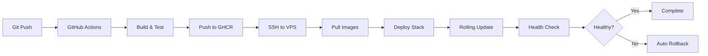

# Docker Swarm Deployment Guide

## Overview

This project now supports **Docker Swarm** orchestration in addition to Docker Compose. Swarm provides:
- 🔄 Rolling updates with automatic rollback
- 🚀 Zero-downtime deployments
- ⚖️ Load balancing across service replicas
- 🔁 Automatic container rescheduling on failure
- 📊 Built-in health check integration

## Quick Start

### 1. Initialize Swarm (One-time setup)

```bash
make swarm-init
# or
./scripts/swarm-init.sh
```

This will:
- Initialize Docker Swarm in single-node mode
- Create the overlay network
- Set up Docker secrets from `.env.prod`

### 2. Deploy the Stack

**Production:**
```bash
make swarm-deploy
# or
./scripts/swarm-deploy.sh prod
```

**Development:**
```bash
make swarm-deploy-dev
# or
./scripts/swarm-deploy.sh dev
```

## Architecture

### Service Replicas

The swarm configuration deploys services with the following replica counts:

| Service | Replicas | Reason |
|---------|----------|--------|
| Microservices | 2 | Load balancing & high availability |
| Databases | 1 | Pinned to manager node (stateful) |
| Traefik | 1 | Single gateway with ingress routing |

### Database Strategy (Single-VPS)

For single-VPS deployments:
- Databases are pinned to the manager node using placement constraints
- Local volumes are used (same as docker-compose)
- Only one replica per database (stateful services)
- Zero configuration changes needed for your existing DB setup

### Resource Limits

Each service has defined resource limits to prevent resource exhaustion:

**Microservices:**
- CPU Limit: 0.5 cores
- Memory Limit: 512MB
- CPU Reservation: 0.1 cores
- Memory Reservation: 128MB

**Databases:**
- CPU Limit: 1.0 core
- Memory Limit: 512MB
- CPU Reservation: 0.25 cores
- Memory Reservation: 256MB

## Common Operations

### Check Service Status

```bash
make swarm-status
# or
docker stack services bwfc
docker stack ps bwfc
```

### View Logs

**All services:**
```bash
make swarm-logs
```

**Specific service:**
```bash
make swarm-logs SVC=location-service
# or
docker service logs -f bwfc_location-service
```

### Scale Services

```bash
make swarm-scale SVC=location-service REPLICAS=3
# or
docker service scale bwfc_location-service=3
```

### Rollback Deployment

**Rollback specific service:**
```bash
make swarm-rollback SVC=location-service
# or
./scripts/swarm-rollback.sh location-service
```

**Rollback all services:**
```bash
make swarm-rollback
# or
./scripts/swarm-rollback.sh
```

### Update a Service

Force update (useful for pulling new images):
```bash
docker service update --force bwfc_location-service
```

Update with new image:
```bash
docker service update --image ghcr.io/username/location-service:v2.0 bwfc_location-service
```

### Remove Stack

```bash
make swarm-down
# or
docker stack rm bwfc
```

### Leave Swarm Mode

```bash
make swarm-clean
# or
docker swarm leave --force
```

## File Structure

```
.
├── docker-compose.yaml          # Base configuration (unchanged)
├── docker-compose.dev.yaml      # Dev overrides (unchanged)
├── docker-compose.prod.yaml     # Prod overrides (unchanged)
├── docker-compose.swarm.yaml    # NEW: Swarm deployment configs
└── scripts/
    ├── swarm-init.sh            # Swarm initialization
    ├── swarm-deploy.sh          # Deployment automation
    └── swarm-rollback.sh        # Rollback automation
```

## Secrets Management

Docker Swarm uses native Docker secrets (encrypted storage):

```bash
# Secrets are created automatically during swarm-init.sh
# They're read from .env.prod and stored in Swarm's Raft store

# List secrets
docker secret ls

# Inspect a secret (doesn't show the actual value)
docker secret inspect postgres_password
```

**Important:** 
- Secrets are NOT stored in plain text files
- They're encrypted in Swarm's internal database
- Services mount them as read-only files at `/run/secrets/`

## CI/CD Integration

The GitHub Actions workflow automatically:
1. Builds and tests all services
2. Pushes images to GHCR
3. Deploys to VPS using Docker Swarm
4. Verifies service health
5. Cleans up old images

**Required Secrets** (in GitHub repository settings):
- `VPS_HOST` - Your VPS hostname/IP
- `VPS_USERNAME` - SSH username
- `VPS_SSH_KEY` - SSH private key
- `VPS_PROJECT_PATH` - Path to project on VPS
- `GHCR_PAT` - GitHub Personal Access Token (for pulling images)

## Deployment Flow



## Monitoring

### Service Health

```bash
# Check which services are running
docker service ls

# Check individual service details
docker service ps bwfc_location-service

# See service events
docker service logs bwfc_location-service
```

### Resource Usage

```bash
# Node resource usage
docker node ls

# Stats for all containers
docker stats

# Service inspect
docker service inspect bwfc_location-service
```

## Troubleshooting

### Service Won't Start

```bash
# Check service logs
docker service logs bwfc_location-service

# Check service tasks (shows failed attempts)
docker service ps bwfc_location-service --no-trunc

# Inspect service configuration
docker service inspect bwfc_location-service
```

### Rolling Update Stuck

```bash
# Check update status
docker service inspect bwfc_location-service --pretty

# Force update completion
docker service update --force bwfc_location-service

# Rollback if needed
docker service rollback bwfc_location-service
```

### Network Issues

```bash
# List networks
docker network ls

# Inspect overlay network
docker network inspect bwfc_microservices-network

# Check service endpoints
docker service inspect bwfc_location-service --format='{{json .Endpoint}}'
```

### Database Connection Issues

```bash
# Verify database is on manager node
docker service ps bwfc_locations-db

# Check database logs
docker service logs bwfc_locations-db

# Verify volume mounts
docker service inspect bwfc_locations-db --format='{{json .Spec.TaskTemplate.ContainerSpec.Mounts}}'
```

## Advantages Over Docker Compose

| Feature | Docker Compose | Docker Swarm |
|---------|---------------|--------------|
| Rolling Updates | ❌ | ✅ |
| Automatic Rollback | ❌ | ✅ |
| Zero-downtime Deploy | ❌ | ✅ |
| Built-in Load Balancing | ❌ | ✅ |
| Self-healing | ❌ | ✅ |
| Service Replicas | Manual | Automated |
| Health Check Integration | Limited | Full |
| Secret Management | .env files | Encrypted secrets |

## Migration Path

You can run **both** Docker Compose and Swarm on the same machine:

1. **Development:** Use `make dev-up` (Docker Compose)
2. **Production:** Use `make swarm-deploy` (Docker Swarm)

The configurations are compatible - you're just choosing different orchestration methods.

## Next Steps

- **Multi-node Swarm:** Add worker nodes for true distributed deployment
- **Monitoring:** Add Prometheus + Grafana stack
- **Logging:** Centralized logging with ELK or Loki
- **Auto-scaling:** Configure based on CPU/memory thresholds
- **External Databases:** Migrate to managed PostgreSQL for true stateless services

## Support

For issues or questions:
1. Check service logs: `make swarm-logs SVC=service-name`
2. Check service status: `make swarm-status`
3. Review deployment events: `docker service ps bwfc_service-name --no-trunc`
